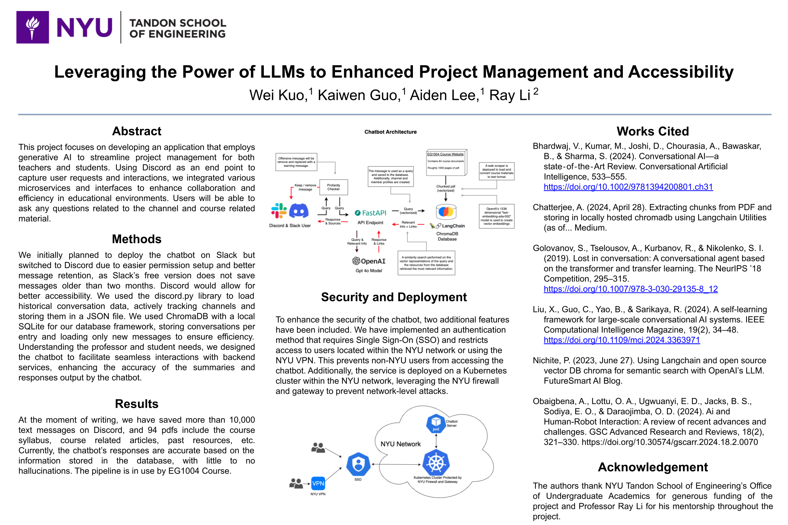

# Project Management Chatbot on Discord

## Overview

This project, developed under the FAMS Lab, is a sophisticated application that integrates generative AI to enhance project management for both teachers and students. Designed to operate on Discord, the chatbot captures user requests and interactions, leveraging advanced microservices and interfaces to improve collaboration and efficiency in educational environments. Users can ask questions related to their channels or course materials and receive accurate, context-aware responses.

## Key Features

- **AI-Powered Responses:** Utilizes OpenAI's GPT-4 and "text-embedding-ada-002" models to generate accurate responses and summaries.
- **Message Management:** Handles over 10,000 messages and 94 PDFs, ensuring efficient data retrieval and management.
- **Sentiment & Profanity Analysis:** Automatically flags and reports offensive content to professors, ensuring a safe and productive environment.
- **Secure & Scalable Deployment:** Deployed on Kubernetes with SSO authentication, ensuring secure access and robust performance.

## Architecture



## Prerequisites

- **Discord Bot Setup:** Create and configure a bot on Discord with the necessary permissions.
- **Dependencies:** Ensure all required Python packages are installed.
- **OpenAI API Key:** A functional OpenAI key is necessary for AI functionalities.

## Installation

1. **Clone the Repository:**
   ```sh
   git clone https://github.com/your-repository-url.git
   cd your-repository
   ```

2. **Install Dependencies:**
   ```sh
   pip install -r requirements.txt
   ```

3. **Set Up the Discord Bot:**
   - Follow Discord's guide to create a bot and obtain a token.
   - Configure the necessary permissions for the bot.

4. **Configure Environment Variables:**
   - Add your OpenAI API key and other environment-specific variables to a `.env` file.

5. **Run the Program:**
   ```sh
   python src/main.py
   ```

## Usage

Once set up, the bot will automatically start listening to channels it's invited to and provide the following functionalities:

- **Query Course Material:** Ask questions related to course content, and the bot will retrieve relevant information from stored documents.
- **Monitor Channel Activities:** The bot can automatically summarize discussions and flag any inappropriate content.
- **Generate Weekly Reports:** Professors receive reports on student engagement, progress, and any flagged issues.

## Contributing

We welcome contributions to enhance the bot's capabilities. Please feel free to open an issue or submit a pull request.

## License

This project is licensed under the MIT License.
